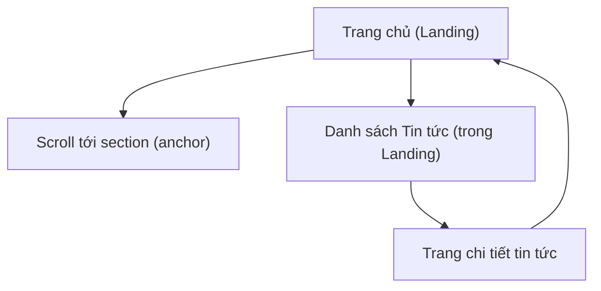

## 1. Product Overview
Website landing “IPAG Career” giới thiệu IPAG, mô tả chương trình/giá trị và điều hướng ứng tuyển.
Mục tiêu: truyền cảm hứng, dẫn người xem đến CTA “Ứng tuyển ngay” và khu vực “Tin tức”.

## 2. Core Features

### 2.1 Feature Module
Sản phẩm gồm các trang chính:
1. **Trang chủ (Landing)**: header điều hướng theo section, hero + CTA, các section giới thiệu, tab năng lực, dải CTA giữa trang, lưới tin tức, footer liên hệ.
2. **Trang chi tiết tin tức**: hiển thị nội dung bài viết theo slug/id, breadcrumb (nếu có), render nội dung HTML.

### 2.2 Page Details
| Page Name | Module Name | Feature description |
|---|---|---|
| Trang chủ (Landing) | Header / Navbar | Hiển thị logo + link điều hướng theo anchor; đổi style khi cuộn; mở/đóng menu mobile. |
| Trang chủ (Landing) | Hero + CTA | Hiển thị tiêu đề, mô tả; nút “ỨNG TUYỂN NGAY” scroll tới section Tin tức (hoặc điểm apply). |
| Trang chủ (Landing) | Program cards | Hiển thị 3 thẻ chương trình (MA/Professional/Executive) theo layout 1 cột (mobile) và cột phải (desktop). |
| Trang chủ (Landing) | Ecosystem ticker (desktop) | Tự động chạy danh sách hệ sinh thái theo chiều ngang; chỉ hiển thị từ breakpoint md. |
| Trang chủ (Landing) | Nhận diện / Bản sắc | Hiển thị gallery 2x2 + danh sách 4 trụ cột (icon + mô tả). |
| Trang chủ (Landing) | Journey | Hiển thị khối “The IPAG Identity” + ảnh journey minh họa. |
| Trang chủ (Landing) | Capabilities tabs | Chuyển tab “Nền tảng/Hệ sinh thái”; render 3 card năng lực theo tab; có hover elevation. |
| Trang chủ (Landing) | Mid CTA band | Hiển thị CTA giữa trang + nút nhảy về khu vực apply. |
| Trang chủ (Landing) | Tin tức | Hiển thị lưới 4 card tin tức; hover zoom ảnh; click điều hướng sang chi tiết (khi có route). |
| Trang chủ (Landing) | Footer / Contact | Hiển thị mô tả, social links, nhóm link explore, email/địa chỉ; copyright. |
| Trang chi tiết tin tức | Resolve route & canonical | Parse slug + id; nếu sai slug thì redirect sang URL chuẩn. |
| Trang chi tiết tin tức | Nội dung bài viết | Hiển thị category + ngày + tiêu đề + render HTML content (dangerouslySetInnerHTML). |
| Trang chi tiết tin tức | Trạng thái lỗi | Nếu URL không hợp lệ hoặc không có bài viết thì hiển thị 404. |

## 3. Core Process
**Luồng người dùng (khách truy cập):**
1) Mở Trang chủ → đọc Hero/sections → dùng Navbar để nhảy đến “we look for / life at IPAG / contact”.
2) Nhấn “ỨNG TUYỂN NGAY” → scroll đến khu vực mục tiêu (Tin tức hoặc apply anchor).
3) Xem lưới Tin tức → chọn 1 bài → mở Trang chi tiết → đọc nội dung → quay lại Trang chủ.

