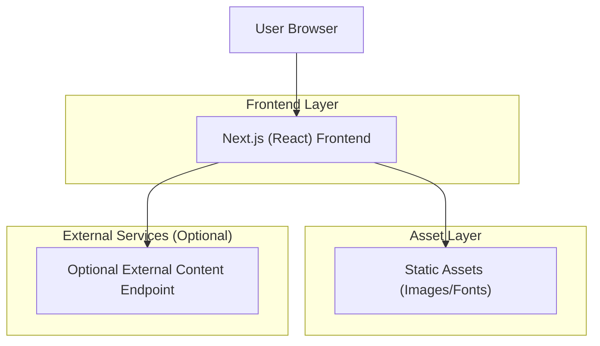

## 1.Architecture design

## 2.Technology Description
- Frontend: Next.js@15 + React@19 + TypeScript@5
- UI: tailwindcss@4 + lucide-react (icons) + motion (menu animation)
- Utilities: dayjs (format date)
- Backend: None (UI-first; dữ liệu có thể hardcode hoặc fetch trực tiếp từ endpoint bên ngoài nếu có)

## 3.Route definitions
| Route | Purpose |
|---|---|
| / | Trang chủ (Landing) với các section/CTA/news/contact |
| /bai-viet/[slug]-[id].html | Trang chi tiết tin tức (canonical URL theo slug+id; redirect nếu slug không khớp) |
| /not-found | Trang 404 (Next.js not-found) |
| /error | Trang lỗi runtime (Next.js error boundary) |
